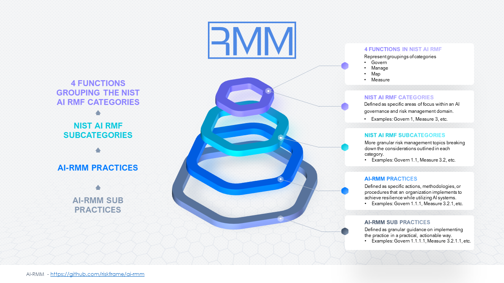

# Artificial Intelligence Resilience Maturity Model (AI-RMM)

The AI-RMM is a conceptual framework used to assess, measure, and improve the resilience of organisations using or planning to use (AI) Artificial Intelligence. The Model examines how organizations are setup with respect to their AI systems and is structured as a series of levels or stages that represent different degrees of resilience maturity.

The Model aligns with the National Institute of Standards and Technology (NIST) AI Risk Management Framework RMF's Core Functions namely,  Govern, Map, Measure, and Manage. It is a tool used to evaluate and measure the effectiveness and sophistication of the risk management processes within such a framework.

Drawing inspiration from the CERT Resilience Maturity Model (CERT RMM), the Model includes maturity levels (Initial, Managed, Defined, Quantitatively Managed, and Optimizing)  that organizations can progress through. These levels reflect the organization's capability to proactively manage and respond to AI-related disruptions, considering factors like governance, workforce diversity, accountability, and engagement with external stakeholders.

## AI-RMM Structure and Examples

Within this repo you will find a comprehensive framework for managing AI risks and implementing best practices, designed to guide organizations in leveraging AI technologies securely and effectively.

### Structure 

AI-RMM is structured around practices and sub-practices, each addressing specific aspects of AI risk management and implementation. Practices are numbered in the format x.x.x, correlating with NIST AI RMF subcategories to provide a clear mapping between the two frameworks. Each practice of AI-RMM aims to answer a _'how'_ question of implementation on that _'what'_ of a specific NIST AI RMF subcategory. The image below illustrates this link between AI-RMM and NIST AI RMF. 

AI-RMM practices are defined as specific actions, methodologies, or procedures that an organization implements to achieve resilience while utilizing AI systems. Below each AI-RMM practice are a set of sub practices. AI-RMM sub practices are defined as granular guidance on implementing the practice in a practical, actionable way. Sometimes AI-RMM sub practices are written in a format that references the AI-RMM practice they are a part of, i.e., x.x.x.x, where x is a digit. Sub practices serve to support and augment the implementation of practices by providing detailed instructions or recommendations, ensuring that organizations can effectively apply the principles outlined in AI-RMM to their AI systems.

### Examples 

Below are a few examples to illustrate how AI-RMM practices align with NIST AI RMF subcategories.

- **AI-RMM Practice "Map 2.2.2. Define Human Oversight and Overriding Mechanisms"**
  - Addresses the NIST AI RMF subcategory _"Map 2.2 Information about the AI system’s knowledge limits and how system output may be utilized and overseen by humans is documented"_.
  - One of the 5 AI-RMM practices (the 'how') helping your organization achieve (the 'what') for Map 2.2.
- **AI-RMM Practice "Govern 6.1.6. Conduct Regular Risk Assessments"**
  - Addresses the NIST AI RMF subcategory _"Govern 6.1 Policies and procedures are in place that address AI risks associated with third-party entities, including risks of infringement of a third-party’s intellectual property or other rights"_.
  - One of the 6 AI-RMM practices (the 'how') helping your organization achieve (the 'what') for Govern 6.1 
- **AI-RMM Practice "Measure 1.3.4. Tailor Assessment Involvement to Risk Tolerance"**
  - Addresses the NIST AI RMF subcategory _"Measure 1.3 Internal experts [...] are involved in regular assessments and updates [...] per organizational risk tolerance"_.
  - One of the 6 AI-RMM practices (the 'how') helping your organization achieve (the 'what') for Measure 1.3
- **AI-RMM Practice "Manage 2.1.2. Explore Viable Non-AI Alternatives"**
  - Addresses the NIST AI RMF subcategory _"Manage 2.1 Resources requirred to manage AI risks are taken into account [...] to reduce [...] impacts.
  - One of the 5 AI-RMM practices (the 'how') helping your organization achieve (the 'what') for Manage 2.1

AI-RMM practices such as the ones outlined above are instrumental in aligning the organization with the objectives and requirements set forth by the NIST AI RMF subcategories for managing their AI risks. By implementing these practices and their corresponding sub-practices, organizations can enhance their resilience and governance frameworks, ensuring the responsible and effective utilization of AI technologies while mitigating associated risks.

### Downloading the framework

We make the framework easier to consume by providing it as a downloadable zip file, containing the supporting materials. Framework itself is provided in PDF, Excel and Json formats for programmatic and functional usage.

